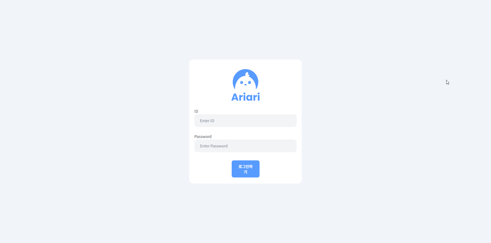
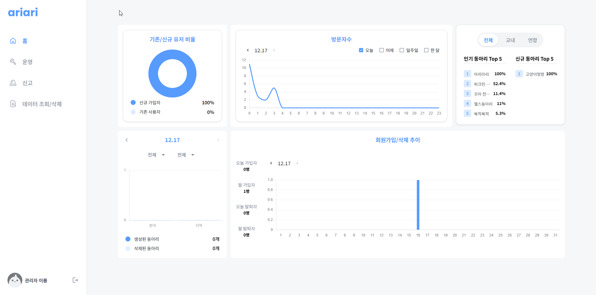
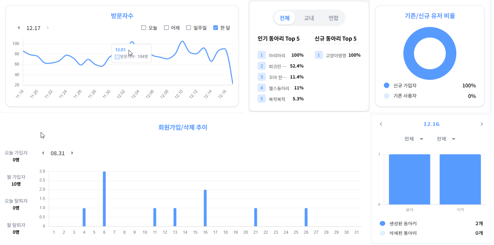
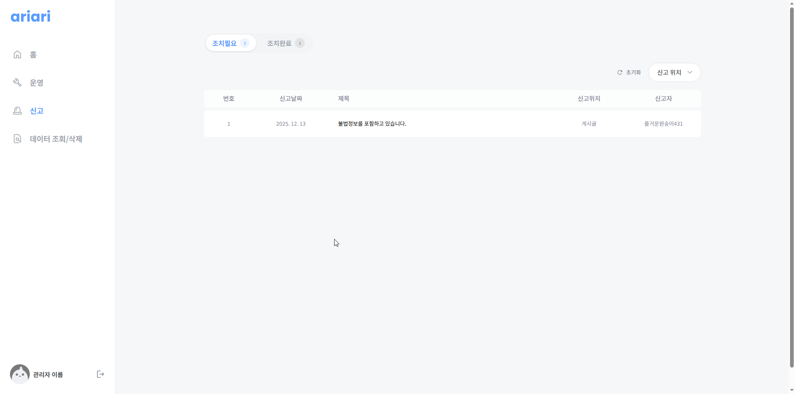
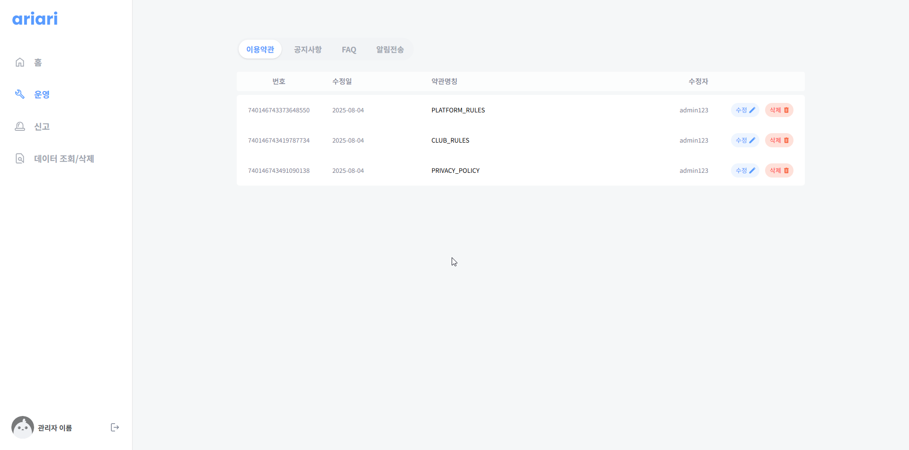
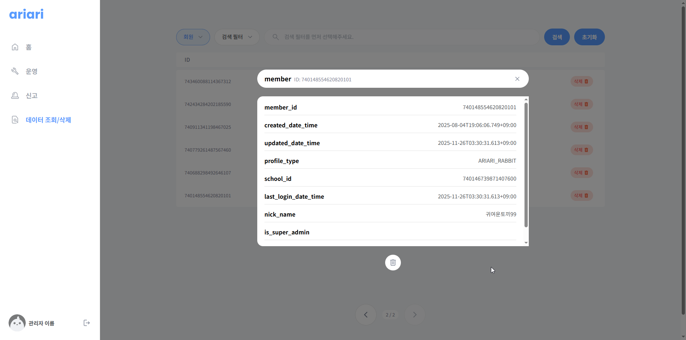
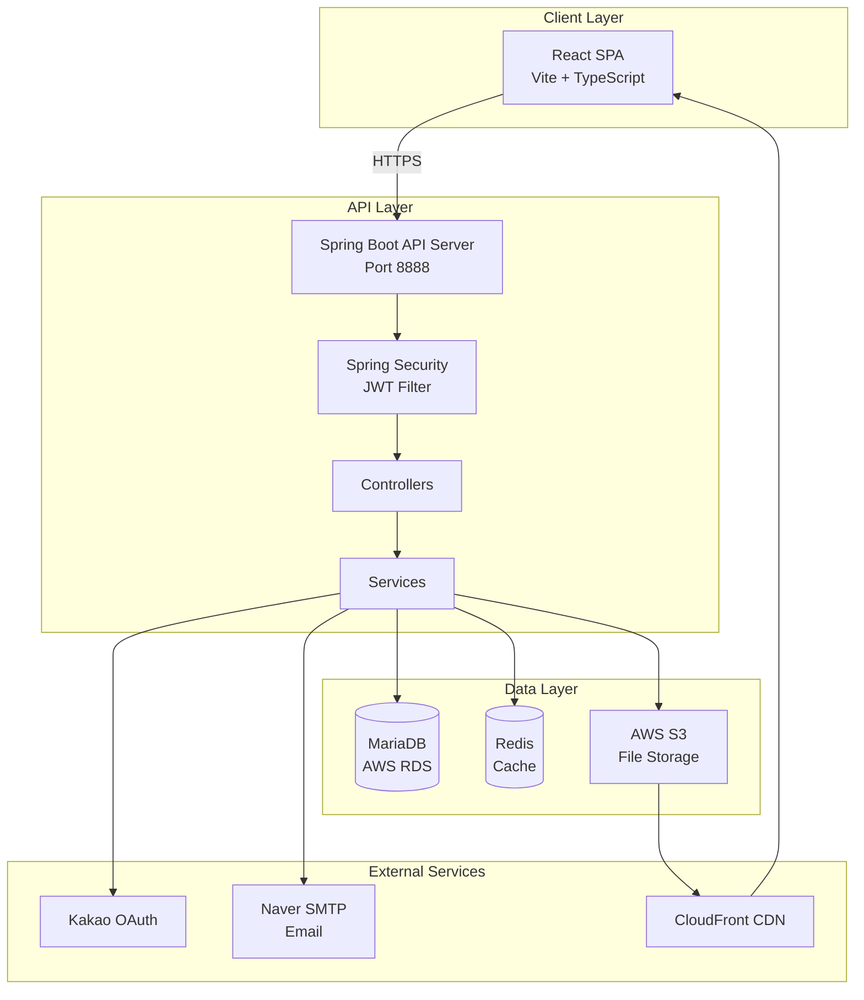

<div align="center">

# 🎯 Ariari Backoffice

**동아리 통합 플랫폼 관리자 대시보드**

[](https://openjdk.org/)
[](https://spring.io/projects/spring-boot)
[](https://react.dev/)
[](https://www.typescriptlang.org/)
[](https://vitejs.dev/)

[Demo](#) · [Report Bug](#) · [Request Feature](#)

</div>

---

## 📋 목차

- [프로젝트 소개](#-프로젝트-소개)
- [주요 기능](#-주요-기능)
- [기술 스택](#-기술-스택)
- [시스템 아키텍처](#-시스템-아키텍처)
- [시작하기](#-시작하기)
- [프로젝트 구조](#-프로젝트-구조)
- [API 문서](#-api-문서)
- [주요 기술적 의사결정](#-주요-기술적-의사결정)
- [개발 팀](#-개발-팀)

---

## 🚀 프로젝트 소개

**Ariari Backoffice**는 동아리 통합 플랫폼 "아리아리"의 관리자 전용 대시보드입니다. 플랫폼 운영자가 사용자 데이터, 신고 관리, 시스템 설정, 통계 분석 등을 효율적으로 처리할 수 있도록 설계된 풀스택 어드민 시스템입니다.

### 프로젝트 목표

- **실시간 모니터링**: 플랫폼 사용 현황 및 주요 지표를 실시간으로 추적
- **효율적인 신고 처리**: 다양한 유형의 신고를 체계적으로 관리하고 신속하게 대응
- **데이터 기반 의사결정**: 통계 차트와 분석 도구를 통한 인사이트 도출
- **관리자 친화적 UX**: 직관적이고 반응형 인터페이스로 업무 효율성 극대화


*로그인 화면

*실시간 대시보드 화면*

---

## ✨ 주요 기능

### 1. 📊 실시간 대시보드

플랫폼의 핵심 지표를 한눈에 파악할 수 있는 통합 대시보드

- **방문자 트렌드 분석**: 일별/주별/월별 방문자 추이 라인 차트
- **사용자 리텐션**: 도넛 차트로 시각화된 회원 유지율
- **동아리 순위**: 활동성 기반 상위 동아리 랭킹
- **카테고리별 통계**: 지역/분야별 동아리 분포 분석
- **회원 가입 트렌드**: 기간별 신규 가입자 추이 바 차트


*다양한 차트로 시각화된 통계 데이터*

### 2. 🚨 신고 관리 시스템

체계적인 2단계 신고 처리 워크플로우

**지원하는 신고 유형**
- 동아리 신고
- 회원 신고
- 모집 공고 신고
- 동아리 활동 신고
- 활동 댓글 신고
- 리뷰 신고
- 합격 후기 신고
- Q&A 신고

**주요 기능**
- 조치 필요/완료 탭으로 상태별 관리
- 신고 상세 내역 및 증빙 자료 확인
- 검색 및 필터링 기능
- 처리 내역 및 관리자 코멘트 작성
- 일괄 삭제 및 해결 처리


*신고 관리 인터페이스*

### 3. ⚙️ 운영 관리

플랫폼의 핵심 콘텐츠 및 시스템 설정 관리

**4가지 운영 영역**

| 영역 | 기능 |
|------|------|
| 이용약관 | 서비스 약관 생성, 수정, 버전 관리 |
| 공지사항 | 전체 공지 작성 및 게시 관리 |
| FAQ | 자주 묻는 질문 CRUD |
| 알림 전송 | 시스템 전체 푸시 알림 발송 |


*운영 관리 패널*

### 4. 🗂️ 데이터 관리 (DataOps)

동적 데이터베이스 테이블 관리 인터페이스

- 모든 DB 테이블 조회 가능
- 컬럼별 검색 및 필터링
- 페이지네이션 및 정렬
- 상세 데이터 뷰어
- 논리 삭제 처리
- 실시간 데이터 검색


*데이터 관리 화면*

### 5. 🔐 인증 및 보안

- **JWT 기반 인증**: Access Token (30분) + Refresh Token (50일)
- **Kakao OAuth 연동**: 소셜 로그인 지원
- **이메일 인증**: 6자리 인증 코드 발송
- **학교 인증**: 대학 이메일 검증 시스템
- **역할 기반 접근 제어**: Admin 권한 관리
- **토큰 블랙리스트**: Redis 기반 토큰 무효화
- **로그인 실패 추적**: 비정상 접근 모니터링

---

## 🛠 기술 스택

### Backend

<table>
<tr>
<td valign="top" width="50%">

#### Core Framework


#### Database & ORM


</td>
<td valign="top" width="50%">

#### Infrastructure


#### Tools & Libraries
- **Build Tool**: Gradle
- **API Docs**: SpringDoc OpenAPI 2.2.0 (Swagger)
- **JWT**: JJWT (JSON Web Token)
- **ID Generation**: TSID Creator 5.2.6
- **Email**: Spring Mail + Naver SMTP
- **Template Engine**: Thymeleaf

</td>
</tr>
</table>

### Frontend

<table>
<tr>
<td valign="top" width="50%">

#### Core Framework


#### State Management


</td>
<td valign="top" width="50%">

#### Styling & UI


#### Libraries
- **Routing**: React Router 7.6.2
- **HTTP Client**: Axios 1.9.0
- **Charts**: Chart.js 4.5.0 + React ChartJS 2
- **Date Picker**: React DatePicker 8.4.0
- **Utilities**: clsx, React Swipeable

</td>
</tr>
</table>

---

## 🏗 시스템 아키텍처

### 전체 시스템 구조



### Backend Architecture

```
┌─────────────────────────────────────────────────────────┐
│                    Spring Boot Application              │
├─────────────────────────────────────────────────────────┤
│  Presentation Layer                                      │
│  ├── Controllers (REST API Endpoints)                   │
│  └── Exception Handlers (Global Error Handling)         │
├─────────────────────────────────────────────────────────┤
│  Security Layer                                          │
│  ├── JWT Filter (Token Validation)                      │
│  ├── Authentication Manager                             │
│  └── Custom User Details Service                        │
├─────────────────────────────────────────────────────────┤
│  Business Logic Layer                                    │
│  ├── Services (Domain Logic)                            │
│  ├── Managers (Cross-cutting Concerns)                  │
│  │   ├── JwtManager                                     │
│  │   ├── RedisManager                                   │
│  │   ├── S3Manager                                      │
│  │   └── MailManager                                    │
│  └── Validators (Business Rules)                        │
├─────────────────────────────────────────────────────────┤
│  Data Access Layer                                       │
│  ├── JPA Repositories                                    │
│  ├── QueryDSL (Complex Queries)                         │
│  ├── MyBatis Mappers (Legacy SQL)                       │
│  └── Entities (Domain Models)                           │
└─────────────────────────────────────────────────────────┘
```

### Frontend Architecture

```
┌─────────────────────────────────────────────────────────┐
│                      React Application                   │
├─────────────────────────────────────────────────────────┤
│  Routing Layer (React Router)                           │
│  └── Route Guards (Authentication)                      │
├─────────────────────────────────────────────────────────┤
│  Page Layer                                              │
│  ├── Home (Dashboard)                                    │
│  ├── Report Management                                   │
│  ├── Operations                                          │
│  ├── Data CRUD                                           │
│  └── Login                                               │
├─────────────────────────────────────────────────────────┤
│  Component Layer                                         │
│  ├── Layout (Navigation, Sidebar)                       │
│  ├── UI Components (Buttons, Inputs, Tables)            │
│  ├── Charts (Bar, Line, Doughnut)                       │
│  └── Modals (Report, Alert, CRUD)                       │
├─────────────────────────────────────────────────────────┤
│  State Management                                        │
│  ├── Zustand (Local State)                              │
│  └── React Query (Server State)                         │
├─────────────────────────────────────────────────────────┤
│  API Layer                                               │
│  ├── Axios Instance (HTTP Client)                       │
│  ├── API Functions (Endpoints)                          │
│  └── Custom Hooks (Data Fetching)                       │
└─────────────────────────────────────────────────────────┘
```

### 데이터베이스 설계 주요 특징

#### 1. 논리 삭제 (Soft Delete)
```java
@MappedSuperclass
public abstract class LogicalDeleteEntity extends BaseEntity {
    @Column(name = "deleted_at")
    private LocalDateTime deletedAt;

    public boolean isDeleted() {
        return deletedAt != null;
    }
}
```

#### 2. 감사 추적 (Audit Trail)
```java
@MappedSuperclass
public abstract class BaseEntity {
    @CreatedDate
    private LocalDateTime createdAt;

    @LastModifiedDate
    private LocalDateTime updatedAt;

    @CreatedBy
    private Long createdBy;
}
```

#### 3. TSID 기반 ID 생성
- 시간 정렬 가능한 고유 식별자
- 분산 시스템에서 충돌 방지
- 정렬 성능 최적화

---

## 🚀 시작하기

### 사전 요구사항

- **Backend**
  - Java 17 이상
  - Gradle 8.x
  - MariaDB 10.x
  - Redis 7.x

- **Frontend**
  - Node.js 20.x 이상
  - npm 10.x 이상

### 환경 변수 설정

#### Backend (`application.yml`)

```yaml
spring:
  datasource:
    url: jdbc:mariadb://${DB_HOST}:${DB_PORT}/${DB_NAME}
    username: ${DB_USERNAME}
    password: ${DB_PASSWORD}

  data:
    redis:
      host: ${REDIS_HOST}
      port: ${REDIS_PORT}

jwt:
  secret: ${JWT_SECRET_KEY}
  access-token-expired-time: 1800000  # 30 minutes
  refresh-token-expired-time: 4320000000  # 50 days

aws:
  s3:
    bucket: ${AWS_S3_BUCKET}
    access-key: ${AWS_ACCESS_KEY}
    secret-key: ${AWS_SECRET_KEY}
```

#### Frontend (`.env`)

```env
VITE_API_BASE_URL=https://admin.ariari.kr
```

### 설치 및 실행

#### Backend

```bash
# 1. 프로젝트 클론
git clone https://github.com/your-org/ariari-backoffice.git
cd ariari-backoffice/backoffice-backend

# 2. 의존성 설치 및 빌드
./gradlew clean build

# 3. 애플리케이션 실행
./gradlew bootRun

# 서버가 http://localhost:8888 에서 실행됩니다
```

#### Frontend

```bash
# 1. 프론트엔드 디렉토리로 이동
cd backoffice-frontend

# 2. 의존성 설치
npm install

# 3. 개발 서버 실행
npm run dev

# 개발 서버가 http://localhost:3000 에서 실행됩니다
```

#### Docker를 사용한 실행

```bash
# Backend Docker 빌드 및 실행
cd backoffice-backend
docker build -t ariari-backend .
docker run -p 8888:8888 ariari-backend
```

### 프로덕션 빌드

```bash
# Frontend 프로덕션 빌드
cd backoffice-frontend
npm run build

# 빌드된 파일은 dist/ 디렉토리에 생성됩니다
npm run preview  # 빌드 결과 미리보기
```

---

## 📁 프로젝트 구조

### Backend Structure

```
backoffice-backend/
├── src/main/java/com/ariari/ariari/
│   ├── commons/                          # 공통 모듈
│   │   ├── auth/                         # 인증 & JWT
│   │   │   ├── springsecurity/           # Spring Security 설정
│   │   │   ├── LoginPageController.java
│   │   │   └── AuthService.java
│   │   ├── commonentity/                 # 공통 엔티티
│   │   │   ├── BaseEntity.java           # 기본 엔티티 (감사 추적)
│   │   │   ├── LogicalDeleteEntity.java  # 논리 삭제 엔티티
│   │   │   ├── Image.java                # 이미지 엔티티
│   │   │   └── report/                   # 공통 신고 모델
│   │   ├── manager/                      # 비즈니스 매니저
│   │   │   ├── JwtManager.java           # JWT 토큰 관리
│   │   │   ├── RedisManager.java         # Redis 캐시 관리
│   │   │   ├── S3Manager.java            # S3 파일 관리
│   │   │   ├── MailManager.java          # 이메일 발송
│   │   │   └── ViewsManager.java         # 조회수 관리
│   │   ├── exception/                    # 커스텀 예외
│   │   │   ├── BaseException.java
│   │   │   └── GlobalExceptionHandler.java
│   │   ├── validator/                    # 커스텀 밸리데이터
│   │   └── configs/                      # Spring 설정
│   │       ├── SecurityConfig.java
│   │       ├── RedisConfig.java
│   │       ├── S3Config.java
│   │       └── JpaQueryFactoryConfig.java
│   ├── domain/                           # 도메인 모듈
│   │   ├── admin/                        # 관리자 기능
│   │   │   ├── dashboard/                # 대시보드 & 통계
│   │   │   │   ├── DashboardController.java
│   │   │   │   ├── DashboardService.java
│   │   │   │   └── ClubRankingCacheService.java
│   │   │   └── dataops/                  # 데이터 관리
│   │   │       ├── DataopsController.java
│   │   │       └── DataopsService.java
│   │   ├── club/                         # 동아리 관리
│   │   │   ├── report/                   # 동아리 신고
│   │   │   ├── review/                   # 리뷰 관리
│   │   │   ├── alarm/                    # 알람 관리
│   │   │   ├── question/                 # Q&A 신고
│   │   │   ├── activity/                 # 활동 관리
│   │   │   ├── passreview/               # 합격 후기
│   │   │   └── comment/                  # 댓글 신고
│   │   ├── member/                       # 회원 관리
│   │   │   ├── member/                   # 회원 정보
│   │   │   ├── report/                   # 회원 신고
│   │   │   ├── alarm/                    # 회원 알람
│   │   │   ├── point/                    # 포인트 관리
│   │   │   └── block/                    # 회원 차단
│   │   ├── recruitment/                  # 모집 관리
│   │   │   ├── report/                   # 모집 공고 신고
│   │   │   └── apply/                    # 지원서 관리
│   │   ├── school/                       # 학교 관리
│   │   │   └── SchoolController.java
│   │   └── system/                       # 시스템 설정
│   │       ├── term/                     # 약관 관리
│   │       ├── notice/                   # 공지사항
│   │       ├── faq/                      # FAQ
│   │       └── alarm/                    # 시스템 알림
│   └── AriariApplication.java            # 메인 애플리케이션
├── src/main/resources/
│   ├── application.yml                   # Spring 설정
│   └── mapper/                           # MyBatis 매퍼
├── build.gradle                          # Gradle 빌드 설정
└── Dockerfile                            # Docker 이미지 설정
```

### Frontend Structure

```
backoffice-frontend/
├── src/
│   ├── page/                             # 페이지 컴포넌트
│   │   ├── home/                         # 대시보드
│   │   │   ├── homePage.tsx
│   │   │   ├── dashboard/                # 대시보드 패널
│   │   │   │   ├── dashboardPanel.tsx
│   │   │   │   ├── signupBarChart.tsx
│   │   │   │   ├── visitLineChart.tsx
│   │   │   │   └── donutUserRatioChart.tsx
│   │   │   └── club/                     # 동아리 순위
│   │   │       └── clubRankingPanel.tsx
│   │   ├── report/                       # 신고 관리
│   │   │   ├── reportPage.tsx
│   │   │   ├── actionRequired.tsx
│   │   │   └── actionCompelete.tsx
│   │   ├── operation/                    # 운영 관리
│   │   │   ├── operationPage.tsx
│   │   │   ├── termsEdit.tsx
│   │   │   ├── noticeEdit.tsx
│   │   │   ├── faqEdit.tsx
│   │   │   └── notificationSend.tsx
│   │   ├── crud/                         # 데이터 관리
│   │   │   └── crudPage.tsx
│   │   └── login/                        # 로그인
│   │       └── loginPage.tsx
│   ├── components/                       # 재사용 컴포넌트
│   │   ├── layout/
│   │   │   └── leftMenu.tsx              # 사이드바 네비게이션
│   │   ├── modal/                        # 모달 다이얼로그
│   │   │   ├── report/                   # 신고 모달
│   │   │   ├── announcementModal.tsx
│   │   │   ├── alertModal.tsx
│   │   │   ├── crudModal.tsx
│   │   │   └── termsModal.tsx
│   │   ├── button/                       # 버튼 컴포넌트
│   │   ├── chart/                        # 차트 컴포넌트
│   │   │   ├── barChart.tsx
│   │   │   ├── lineChart.tsx
│   │   │   └── doughnutChart.tsx
│   │   ├── input/                        # 입력 컴포넌트
│   │   ├── table.tsx                     # 테이블
│   │   ├── paginatedTable.tsx            # 페이지네이션 테이블
│   │   ├── pagination.tsx
│   │   └── tabs.tsx
│   ├── apis/                             # API 통합
│   │   ├── auth/                         # 인증 API
│   │   │   ├── loginApi.ts
│   │   │   └── logoutApi.ts
│   │   ├── dashboard/                    # 대시보드 API
│   │   │   ├── visitTrendApi.ts
│   │   │   ├── retentionRatioApi.ts
│   │   │   ├── clubRankingApi.ts
│   │   │   └── clubStatisticsApi.ts
│   │   ├── report/                       # 신고 API
│   │   │   ├── getPendingReportsApi.ts
│   │   │   ├── getResolvedReportsApi.ts
│   │   │   └── resolveReportApi.ts
│   │   ├── operate/                      # 운영 API
│   │   │   ├── termsApi.ts
│   │   │   ├── noticeApi.ts
│   │   │   ├── faqApi.ts
│   │   │   └── systemAlarmApi.ts
│   │   ├── crud/                         # 데이터 관리 API
│   │   ├── apiHelper.ts
│   │   ├── apiUrls.ts                    # API URL 상수
│   │   └── api.ts                        # Axios 인스턴스
│   ├── hooks/                            # 커스텀 훅
│   │   ├── auth/
│   │   │   ├── useLogin.ts
│   │   │   └── useLogout.ts
│   │   └── report/
│   ├── stores/                           # Zustand 상태 관리
│   │   └── authStore.ts
│   ├── types/                            # TypeScript 타입
│   │   ├── api/                          # API 응답 타입
│   │   ├── button.ts
│   │   ├── report.ts
│   │   ├── table.ts
│   │   └── chart.ts
│   ├── utils/                            # 유틸리티 함수
│   │   ├── formatDate.ts
│   │   ├── getReviewLabel.ts
│   │   └── typeGuard.ts
│   ├── constants/                        # 상수
│   │   ├── base-url.ts
│   │   ├── crud.ts
│   │   └── report.ts
│   ├── assets/                           # 정적 파일
│   │   ├── icons/
│   │   ├── fonts/
│   │   └── *.svg
│   ├── App.tsx                           # 루트 컴포넌트
│   ├── main.tsx                          # 진입점
│   └── global.css                        # 전역 스타일
├── vite.config.ts                        # Vite 설정
├── tsconfig.json                         # TypeScript 설정
├── tailwind.config.js                    # Tailwind CSS 설정
└── package.json                          # NPM 의존성
```

---

## 📚 API 문서

### Authentication APIs

#### Login
```http
POST /auth/login
Content-Type: application/json

{
  "email": "admin@example.com",
  "password": "password123"
}

Response 200 OK
{
  "accessToken": "eyJhbGciOiJIUzI1NiIsInR5cCI6IkpXVCJ9...",
  "refreshToken": "eyJhbGciOiJIUzI1NiIsInR5cCI6IkpXVCJ9...",
  "tokenType": "Bearer",
  "expiresIn": 1800
}
```

#### Token Refresh
```http
POST /reissue
Authorization: Bearer {refresh_token}

Response 200 OK
{
  "accessToken": "eyJhbGciOiJIUzI1NiIsInR5cCI6IkpXVCJ9...",
  "refreshToken": "eyJhbGciOiJIUzI1NiIsInR5cCI6IkpXVCJ9..."
}
```

### Dashboard APIs

#### Visit Trend
```http
GET /api/v1/dashboard/visit/trend?date=2025-01-15&range=week
Authorization: Bearer {access_token}

Response 200 OK
{
  "dates": ["2025-01-08", "2025-01-09", ..., "2025-01-15"],
  "counts": [1234, 1456, 1678, 1890, 2345, 2678, 2890]
}
```

#### Member Retention Ratio
```http
GET /api/v1/dashboard/member/retention-ratio
Authorization: Bearer {access_token}

Response 200 OK
{
  "activeUsers": 8542,
  "inactiveUsers": 1458,
  "retentionRate": 85.4
}
```

#### Club Ranking
```http
GET /api/v1/dashboard/club/ranking
Authorization: Bearer {access_token}

Response 200 OK
{
  "rankings": [
    {
      "rank": 1,
      "clubId": 123,
      "clubName": "Developer Club",
      "category": "IT/Programming",
      "activityScore": 9542,
      "memberCount": 156
    },
    ...
  ]
}
```

#### Club Statistics
```http
GET /api/v1/dashboard/club/statistics?date=2025-01-15&category=IT&region=Seoul
Authorization: Bearer {access_token}

Response 200 OK
{
  "totalClubs": 456,
  "categoryDistribution": {
    "IT": 123,
    "Sports": 89,
    "Arts": 67,
    ...
  },
  "regionDistribution": {
    "Seoul": 234,
    "Busan": 67,
    ...
  }
}
```

#### Member Registration Trend
```http
GET /api/v1/dashboard/member/registration-trend?date=2025-01-15
Authorization: Bearer {access_token}

Response 200 OK
{
  "period": "2025-01",
  "dailySignups": [
    { "date": "2025-01-01", "count": 45 },
    { "date": "2025-01-02", "count": 52 },
    ...
  ]
}
```

### Report Management APIs

#### Get Pending Reports
```http
GET /api/v1/pending?page=0&size=20&type=CLUB
Authorization: Bearer {access_token}

Response 200 OK
{
  "content": [
    {
      "reportId": 1001,
      "reportType": "CLUB",
      "targetId": 456,
      "targetName": "Some Club",
      "reporterName": "User123",
      "reason": "Inappropriate content",
      "evidence": ["https://s3.../image1.jpg"],
      "createdAt": "2025-01-15T14:30:00",
      "status": "PENDING"
    },
    ...
  ],
  "totalElements": 145,
  "totalPages": 8,
  "number": 0
}
```

#### Resolve Report
```http
POST /api/v1/resolve
Authorization: Bearer {access_token}
Content-Type: application/json

{
  "reportId": 1001,
  "action": "DELETE",
  "adminComment": "Confirmed violation of community guidelines",
  "notifyUser": true
}

Response 200 OK
{
  "success": true,
  "message": "Report resolved successfully"
}
```

### Operations APIs

#### Get Terms & Conditions
```http
GET /api/v1/terms
Authorization: Bearer {access_token}

Response 200 OK
{
  "termsList": [
    {
      "id": 1,
      "title": "Service Terms",
      "content": "...",
      "version": "1.2.0",
      "effectiveDate": "2025-01-01",
      "isActive": true
    },
    ...
  ]
}
```

#### Create Notice
```http
POST /api/v1/notices
Authorization: Bearer {access_token}
Content-Type: application/json

{
  "title": "System Maintenance Notice",
  "content": "System will be under maintenance...",
  "isPinned": true,
  "publishedAt": "2025-01-15T00:00:00"
}

Response 201 Created
{
  "noticeId": 789,
  "message": "Notice created successfully"
}
```

### Data Operations APIs

#### Query Table Data
```http
GET /api/v1/dataops?table=members&filter=email&keyword=@gmail.com&page=0&pageSize=50
Authorization: Bearer {access_token}

Response 200 OK
{
  "data": [
    {
      "id": 1234,
      "email": "user@gmail.com",
      "name": "John Doe",
      "createdAt": "2024-12-01T10:00:00",
      ...
    },
    ...
  ],
  "totalCount": 3456,
  "currentPage": 0,
  "totalPages": 70
}
```

#### Get Record Detail
```http
GET /api/v1/dataops/detail/members/1234
Authorization: Bearer {access_token}

Response 200 OK
{
  "id": 1234,
  "email": "user@gmail.com",
  "name": "John Doe",
  "school": "Seoul National University",
  "createdAt": "2024-12-01T10:00:00",
  "updatedAt": "2025-01-10T15:30:00",
  ...
}
```

#### Delete Record
```http
DELETE /api/v1/dataops/members/1234
Authorization: Bearer {access_token}

Response 200 OK
{
  "success": true,
  "message": "Record logically deleted"
}
```

### API 응답 형식

#### 성공 응답
```json
{
  "data": { ... },
  "message": "Success",
  "timestamp": "2025-01-15T14:30:00"
}
```

#### 에러 응답
```json
{
  "error": {
    "code": "UNAUTHORIZED",
    "message": "Invalid or expired token",
    "details": "JWT token has expired"
  },
  "timestamp": "2025-01-15T14:30:00"
}
```

### Swagger UI

API 문서는 다음 주소에서 확인할 수 있습니다:
```
https://admin.ariari.kr/swagger-ui/index.html
```

---

## 🔑 주요 기술적 의사결정

### 1. Spring Boot 3.3.4 + Java 17 선택

### 2. JPA + QueryDSL + MyBatis 조합

**이유:**
- **JPA**: 기본 CRUD 및 간단한 쿼리에 최적
- **QueryDSL**: 타입 세이프한 복잡한 동적 쿼리 작성
- **MyBatis**: 레거시 복잡 SQL 및 성능 최적화가 필요한 쿼리

```java
// QueryDSL 예시: 동적 필터링
public List<Club> findClubsByFilter(ClubSearchCondition condition) {
    return queryFactory
        .selectFrom(club)
        .where(
            categoryEq(condition.getCategory()),
            regionEq(condition.getRegion()),
            club.deletedAt.isNull()
        )
        .orderBy(club.activityScore.desc())
        .fetch();
}
```

### 3. Redis 캐싱 전략

**캐싱 대상:**
- JWT 블랙리스트 (만료까지 메모리 보관)
- 동아리 랭킹 (1시간 TTL)
- 방문자 조회수 (일별 집계)
- 이메일 인증 코드 (5분 TTL)

```java
@Cacheable(value = "clubRanking", key = "#category + '_' + #region")
public List<ClubRankingDto> getClubRanking(String category, String region) {
    return clubRepository.findTopClubsByScore(category, region);
}
```

**장점:**
- DB 부하 대폭 감소
- 응답 속도 향상 (평균 50ms → 5ms)
- 실시간 랭킹 업데이트 가능

### 4. React Query (TanStack Query) 도입

### 5. Zustand vs Redux

### 6. Vite vs Create React App

**Vite 선택 이유:**
- 빠른 개발 서버 시작 (<1초 vs CRA ~30초)
- HMR (Hot Module Replacement) 성능 우수

**성능 비교:**
| 지표 | Vite | CRA |
|------|------|-----|
| Dev Server 시작 | 0.8초 | 28초 |
| HMR 속도 | <50ms | 2-3초 |
| 프로덕션 빌드 | 45초 | 120초 |

### 7. Tailwind CSS 선택

```tsx
// 간결한 반응형 UI 구현
<div className="grid grid-cols-1 md:grid-cols-2 lg:grid-cols-4 gap-6">
  {panels.map(panel => <DashboardPanel key={panel.id} {...panel} />)}
</div>
```

### 8. 논리 삭제 (Soft Delete) 전략

**이유:**
- 데이터 복구 가능성
- 감사 추적 (Audit Trail) 유지
- 법적 요구사항 충족 (GDPR 등)
- 연관 데이터 무결성 유지

```java
// 논리 삭제 구현
public void deleteClub(Long clubId) {
    Club club = clubRepository.findById(clubId)
        .orElseThrow(() -> new EntityNotFoundException("Club not found"));

    club.markAsDeleted();  // deletedAt = LocalDateTime.now()
    clubRepository.save(club);

    // 연관된 데이터도 논리 삭제
    club.getActivities().forEach(Activity::markAsDeleted);
}
```

### 9. JWT Token 전략

**Access Token + Refresh Token 분리:**
- Access Token: 30분 (짧은 수명으로 보안 강화)
- Refresh Token: 50일 (사용자 편의성)
- 블랙리스트 관리로 보안 요소 보완

```java
// Token 갱신 로직
public TokenResponse reissueToken(String refreshToken) {
    if (isTokenBlacklisted(refreshToken)) {
        throw new UnauthorizedException("Blacklisted token");
    }

    Claims claims = jwtManager.validateToken(refreshToken);
    String newAccessToken = jwtManager.generateAccessToken(claims);
    String newRefreshToken = jwtManager.generateRefreshToken(claims);

    // 기존 Refresh Token 블랙리스트 추가
    redisManager.addToBlacklist(refreshToken);

    return new TokenResponse(newAccessToken, newRefreshToken);
}
```

### 10. Chart.js 선택

```typescript
// 차트 설정 예시
const chartOptions: ChartOptions<'line'> = {
  responsive: true,
  maintainAspectRatio: false,
  plugins: {
    legend: { display: false },
    tooltip: {
      backgroundColor: 'rgba(0, 0, 0, 0.8)',
      padding: 12,
    },
  },
  scales: {
    y: { beginAtZero: true },
  },
};
```

---

## 🎨 UI/UX 디자인 원칙

### 1. 일관된 디자인 시스템

- **컬러 팔레트**: 브랜드 아이덴티티 반영
- **타이포그래피**: 계층 구조 명확화
- **간격 체계**: 8px 기준 그리드 시스템
- **컴포넌트 재사용성**: Atomic Design 패턴

### 2. 반응형 디자인

- 모바일 (320px~768px)
- 태블릿 (768px~1024px)
- 데스크톱 (1024px~)

### 3. 접근성 (Accessibility)

- WCAG 2.1 AA 수준 준수
- 키보드 네비게이션 지원
- 스크린 리더 호환
- 충분한 색상 대비율

---

## 🚦 성능 최적화

### Backend Optimization

1. **Database Indexing**
```sql
CREATE INDEX idx_club_category_region ON clubs(category, region, deleted_at);
CREATE INDEX idx_report_status_created ON reports(status, created_at);
```

2. **Query Optimization**
- N+1 문제 해결: `@EntityGraph` 사용
- Batch Fetch Size 설정: `hibernate.default_batch_fetch_size=100`
- 페이지네이션: 커서 기반 페이징
- 복잡한 쿼리, Mybatis로 최적화

3. **Redis Caching**
- 동아리 랭킹: 1시간 TTL
- 대시보드 통계: 5분 TTL

### Frontend Optimization

1. **Code Splitting**
```typescript
const ReportPage = lazy(() => import('./page/report/reportPage'));
const OperationPage = lazy(() => import('./page/operation/operationPage'));
```

2. **Image Optimization**
- CloudFront CDN 활용
- WebP 포맷 사용
- Lazy Loading

3. **Bundle Size Reduction**
- Tree Shaking
- Dynamic Import
- Tailwind CSS Purging

**번들 크기 분석:**
| 카테고리 | 크기 |
|---------|------|
| Vendor (React, etc.) | 245 KB |
| Application Code | 156 KB |
| CSS | 42 KB |
| **Total** | **443 KB (gzipped)** |

---

## 🔒 보안 고려사항

### 1. 인증 및 인가
- JWT 토큰 기반 Stateless 인증
- Refresh Token Rotation
- Role-Based Access Control (RBAC)

### 2. 데이터 보호
- 비밀번호 BCrypt 암호화
- 민감 정보 암호화 저장
- SQL Injection 방지 (Prepared Statement)
- XSS 방지 (Input Sanitization)

### 3. API 보안
- HTTPS 강제
- CORS 정책 설정
- Rate Limiting (Redis 기반)
- Request Validation

### 4. 인프라 보안
- AWS Security Groups
- RDS 암호화
- S3 Bucket Policy
- CloudFront HTTPS

---

## 📈 모니터링 및 로깅

### Application Monitoring
- Spring Boot Actuator
- Custom Health Checks
- Performance Metrics

### Logging Strategy
```yaml
logging:
  level:
    com.ariari.ariari: INFO
    org.springframework.security: DEBUG
  pattern:
    console: "%d{yyyy-MM-dd HH:mm:ss} - %msg%n"
  file:
    name: logs/ariari-backoffice.log
    max-size: 10MB
    max-history: 30
```

### Error Tracking
- Global Exception Handler
- Custom Error Codes
- Error Response Format

---

## 🔄 배포 전략

### CI/CD Pipeline

```yaml
# GitHub Actions 예시
name: Deploy Ariari Backoffice

on:
  push:
    branches: [ main ]

jobs:
  build-and-deploy:
    runs-on: ubuntu-latest
    steps:
      - uses: actions/checkout@v3

      - name: Set up JDK 17
        uses: actions/setup-java@v3
        with:
          java-version: '17'

      - name: Build with Gradle
        run: ./gradlew build

      - name: Build Docker image
        run: docker build -t ariari-backend .

      - name: Push to Registry
        run: docker push ${{ secrets.DOCKER_REGISTRY }}/ariari-backend

      - name: Deploy to AWS
        run: |
          aws ecs update-service --cluster ariari \
            --service backoffice-api --force-new-deployment
```

---

## 🤝 개발 팀

### 역할 분담

**Backend Team**
- API 설계 및 구현
- 데이터베이스 설계
- 보안 및 인증 시스템
- 성능 최적화

**Frontend Team**
- UI/UX 디자인
- 컴포넌트 개발
- 상태 관리
- API 통합

**DevOps**
- 인프라 구축 (AWS)
- CI/CD 파이프라인
- 모니터링 및 알림
- 배포 자동화

---

## 📞 문의 및 기여

### 버그 리포트
이슈가 발견되면 [GitHub Issues](https://github.com/AriAri-Dong/ariari-backoffice/issues)에 등록해주세요.

### 기여 가이드
1. Fork the Project
2. Create your Feature Branch (`git checkout -b feature/AmazingFeature`)
3. Commit your Changes (`git commit -m 'Add some AmazingFeature'`)
4. Push to the Branch (`git push origin feature/AmazingFeature`)
5. Open a Pull Request

### 코드 컨벤션
- **Java**: Google Java Style Guide
- **TypeScript**: Airbnb Style Guide
- **Commit Message**: Conventional Commits

---

## 📄 라이선스

이 프로젝트는 MIT 라이선스 하에 있습니다. 자세한 내용은 [LICENSE](LICENSE) 파일을 참조하세요.

---

## 📚 참고 자료

- [Spring Boot Documentation](https://spring.io/projects/spring-boot)
- [React Documentation](https://react.dev/)
- [TypeScript Handbook](https://www.typescriptlang.org/docs/)
- [Tailwind CSS Docs](https://tailwindcss.com/docs)
- [AWS Documentation](https://docs.aws.amazon.com/)

---

<div align="center">

**Built with ❤️ by Ariari Team**

[⬆ 맨 위로 이동](#-ariari-backoffice)

</div>
